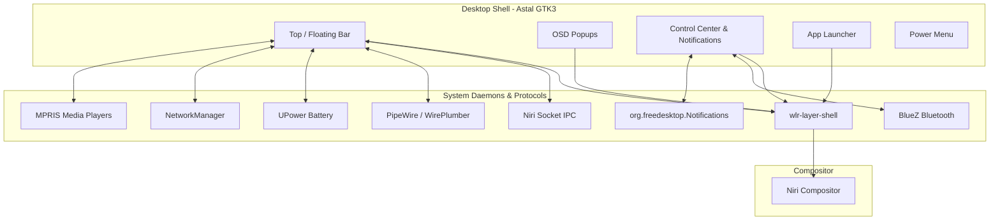

# Investigación: Arquitectura de Desktop Shells en Wayland & Plan de Actividades

Este documento detalla qué componentes conforman un *Desktop Shell* moderno en Wayland, cómo interactúa con el compositor (**Niri**) y el sistema operativo, y define el plan de trabajo modular para desarrollar **`niri-astal-shell`**.

---

## 1. ¿Qué es un Desktop Shell y cómo funciona?

A diferencia de entornos monolíticos como GNOME Shell o KDE Plasma, en compositores Wayland modulares e independientes (como **Niri**, Sway o Hyprland) el compositor se encarga **únicamente** de:
1. Renderizado de clientes y ventanas.
2. Gestión de entradas de ratón/teclado/touchpad.
3. Posicionamiento y mosaico (*scrolling horizontal* en el caso de Niri).

El **Desktop Shell** es un cliente Wayland externo privilegiado que provee toda la interfaz gráfica de usuario del sistema (paneles, menús, widgets, bandejas del sistema y notificaciones).

---

## 2. Protocolos e Interfaces Clave

| Interfaz / Protocolo | Función | Uso en Astal |
| :--- | :--- | :--- |
| **`wlr-layer-shell`** | Permite crear ventanas fijas en capas (`background`, `bottom`, `top`, `overlay`) y reservar espacio exclusivo en pantalla (*struts*). | Controlado automáticamente por `Astal.Window` y `gtk-layer-shell`. |
| **Niri IPC (Socket Unix)** | Transmite eventos de ventanas, columnas activas, monitores y espacios de trabajo. | `astal/io` o subprocesos escuchando el stream de eventos de `niri msg --json event-stream`. |
| **WirePlumber / PipeWire** | Control de volumen de audio, fuentes (micrófono), salidas (auriculares/altavoces) y mute. | `libastal-wireplumber` (`AstalWp`). |
| **UPower (DBus)** | Nivel de carga de batería, tasa de consumo, tiempo restante y estado (cargando/descargando). | `libastal-battery` (`AstalBattery`). |
| **NetworkManager (DBus)** | Detección de Wi-Fi, Ethernet, escaneo de puntos de acceso y fuerza de señal. | `libastal-network` (`AstalNetwork`). |
| **MPRIS2 (DBus)** | Metadatos de música (Spotify, Firefox, mpv): carátula, artista, título y comandos de reproducción. | `libastal-mpris` (`AstalMpris`). |
| **Freedesktop Notifications** | Servidor daemon para interceptar, almacenar y renderizar notificaciones del sistema. | `libastal-notifd` (`AstalNotifd`). |
| **StatusNotifier (SNI)** | Bandeja del sistema (*System Tray*) para iconos de aplicaciones de fondo (Discord, Steam, etc.). | `libastal-tray` (`AstalTray`). |

---

## 3. Anatomía de los Componentes del Shell

### A. Barra de Estado (*Status Bar*)
* **Izquierda (Contexto de Ventanas):**
  * Botón de menú de aplicaciones.
  * Indicador de espacios de trabajo / columnas de Niri reactivo.
  * Título / icono de la ventana enfocada.
* **Centro (Información & Multimedia):**
  * Reloj digital con formato configurable y fecha.
  * Widget compacto de reproducción de música (click para play/pause, scroll para cambiar pista).
* **Derecha (Estado del Sistema & Toggles):**
  * Bandeja del sistema (*System Tray / SNI*).
  * Consumo de recursos (CPU / RAM).
  * Nivel de batería con icono dinámico según porcentaje y carga.
  * Icono de Red/Wi-Fi con estado de conexión.
  * Icono de volumen (con soporte para scroll de rueda del ratón para ajustar volumen al vuelo).
  * Botón de acceso al Centro de Control.

---

### B. OSD (*On-Screen Display*)
* Ventana temporal en capa `overlay` que aparece en pantalla durante ~1.5 segundos al modificar:
  * Volumen de altavoces o auriculares.
  * Silenciado de micrófono.
  * Brillo de la pantalla.

---

### C. Centro de Control & Notificaciones (*Quick Settings*)
* **Panel de Notificaciones:**
  * Lista de notificaciones con botón "Descartar todas".
  * Acciones interactivas.
* **Toggles Rápidos:**
  * Wi-Fi (encendido/apagado y selector de redes).
  * Bluetooth (emparejamiento rápido).
  * Modo No Molestar (DND).
  * Modo Noche / Filtro de luz azul.
* **Sliders de Control:**
  * Control deslizante de volumen de audio y brillo de pantalla.
* **Widget MPRIS Expandido:**
  * Carátula en alta resolución, barra de progreso de reproducción y controles completos.

---

### D. Lanzador de Aplicaciones (*App Launcher*)
* Ventana modal centrada con capa de desenfoque (*backdrop blur*).
* Búsqueda difusa (*fuzzy search*) de ejecutables y archivos `.desktop` indexados por `libastal-apps`.
* Categorías de aplicaciones y ejecución directa en background.

---

### E. Menú de Sesión (*Power Menu*)
* Interfaz con opciones para:
  * Bloquear pantalla (*Lock*).
  * Suspender (*Sleep*).
  * Cerrar sesión (*Logout de Niri*).
  * Reiniciar (*Reboot*).
  * Apagar (*Shutdown*).

---

## 4. Plan de Actividades (Roadmap de Desarrollo)

### Lista de Tareas Detallada:

- [ ] **Fase 1: Estructura Modular y Sistema de Diseño**
  - [ ] Diseñar el sistema de variables SCSS (colores base, fuentes, bordes y espaciados).
  - [ ] Configurar carga modular de componentes en `app.ts`.
  - [ ] Crear utilidades comunes (formato de tiempo, iconos, helpers de ejecución).

- [ ] **Fase 2: Barra de Estado Principal**
  - [ ] Widget de Reloj + Calendario desplegable.
  - [ ] Widget de Batería (`AstalBattery`).
  - [ ] Widget de Red / Wi-Fi (`AstalNetwork`).
  - [ ] Widget de Audio con slider/scroll (`AstalWp` / WirePlumber).
  - [ ] Bandeja del sistema (`AstalTray`).
  - [ ] Reproductor multimedia compacto (`AstalMpris`).

- [ ] **Fase 3: Integración Específica con Niri IPC**
  - [ ] Conectar con el socket IPC de Niri para escuchar eventos de ventanas y workspaces en tiempo real.
  - [ ] Dibujar indicadores de columnas/workspaces con estado activo/inactivo y click para cambiar de foco.

- [ ] **Fase 4: Popups OSD (On-Screen Display)**
  - [ ] Ventana OSD flotante animada para volumen de audio.
  - [ ] Ventana OSD flotante para brillo de pantalla.
  - [ ] Temporizador automático de desaparición suave (*fade-out*).

- [ ] **Fase 5: Centro de Control y Notificaciones**
  - [ ] Implementar servidor de notificaciones (`AstalNotifd`) con popups flotantes (*toasts*).
  - [ ] Crear panel lateral retráctil (*slide-in*) con historial de notificaciones.
  - [ ] Añadir toggles de Wi-Fi, Bluetooth y modo DND.
  - [ ] Sliders de volumen y brillo integrados.

- [ ] **Fase 6: App Launcher & Power Menu**
  - [ ] Crear ventana del lanzador de aplicaciones con búsqueda fuzzy rápida (`AstalApps`).
  - [ ] Crear modal de confirmación de apagado/reinicio/bloqueo de sesión.

- [ ] **Fase 7: Theming Dinámico y Lanzamiento**
  - [ ] Integración con Matugen o paletas de colores personalizadas.
  - [ ] Configurar scripts de arranque y binds finales en Niri `config.kdl`.
  - [ ] Documentación final y release v0.1.0 en GitHub.
